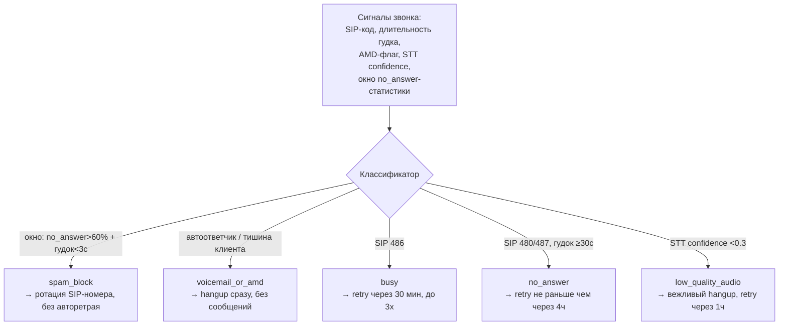

# Архитектура voice-sales-agent

## Поток одного хода диалога (исходящий звонок)

```mermaid
flowchart TB
    RING[Звонок поднят] --> GREET[Детерминированное приветствие<br/>без LLM, TTS-кэш]
    GREET --> LISTEN[Речь клиента → STT]
    LISTEN --> STAGE{Стадия диалога<br/>greet/qualify/present/objection/close}
    STAGE --> LLM[LLM-реплика<br/>system-промпт + стадия + known_facts]
    LLM --> GUARD[Анти-робот guardrails:<br/>снять дежурный зачин →<br/>снять эхо известных фактов →<br/>один вопрос за ход]
    GUARD --> TTS[TTS: кэш по hash(голос+настройки+текст)]
    TTS --> PLAY[Voximplant воспроизводит]
    PLAY --> LISTEN

    STAGE -->|LLM недоступна| FALLBACK[Натуральный текстовый fallback<br/>по стадии, без остановки звонка]

    PLAY --> FINISH[Звонок завершён]
    FINISH --> CLASSIFY[LLM-классификация исхода<br/>по словам клиента; fallback —<br/>keyword-классификатор]
    CLASSIFY -->|interested| WA[WhatsApp: Green API]
    CLASSIFY -->|interested| CRM[Карточка лида: AlfaCRM]
```

## Классификация сбоев звонка и recovery (defense in depth для телефонии)

Голосовой канал ломается множеством разных способов, и одинаковый ответ на все
("просто ретраим") или мешает клиенту (спам автоответчику), или теряет лида
(нет ретраев вообще). Поэтому сбои размечены в явную таксономию (в проекте —
13 классов), и у каждого — свой root cause, свой детект и свой recovery.



| Класс | Root cause | Recovery |
|---|---|---|
| `spam_block` | Оператор/приложение блокирует номер после серии звонков разным абонентам | Ротация SIP-номера, прогрев ≤20 звонков/день, без автоматического ретрая |
| `voicemail_or_amd` | AMD не поймал автоответчик, либо длинная безответная тишина в начале | Hangup сразу, без сообщений, лид молчит 24 часа |
| `busy` | SIP 486 | Автоматический retry (до 3 попыток), затем `busy_persistent` |
| `no_answer` | SIP 480/487 после полного таймаута звонка | Retry не раньше чем через 4 часа (не путать с `busy` — другая политика) |
| `low_quality_audio` | Шум/эхо/битрейт → STT не отделяет речь | Агент вежливо прощается, retry через 1 час, не отправляет в LLM мусорный транскрипт |

## Слои против "звучит как бот"

| Слой | Что защищает | Механизм |
|---|---|---|
| Промпт (стадии диалога) | Общий тон и структуру ответа | system-промпт + инструкция стадии, лимит токенов на терминальных репликах |
| Детерминированный ход 0 | Паузу тишины сразу после снятия трубки | Шаблон приветствия без LLM + TTS-кэш |
| Guardrails после LLM | Конкретные, воспроизводимые "робо-паттерны" в ответах модели | Regex-слой: дежурные зачины, эхо фактов, один вопрос за ход |
| TTS-кэш | Повторный синтез одинаковых фраз | Контентно-адресуемый кэш, ключ включает голос и все TTS-настройки |
| Fallback без LLM/TTS | Обрыв диалога при недоступности провайдера | Натуральный текстовый fallback по стадии, звонок не падает |

**Ключевой принцип:** промпт задаёт общий тон, но конкретные "проговорки", которые
выдают бота, ловятся и правятся не переобучением промпта на каждую жалобу, а
маленьким детерминированным слоем поверх — так фикс воспроизводим и не
регрессирует остальной диалог.
